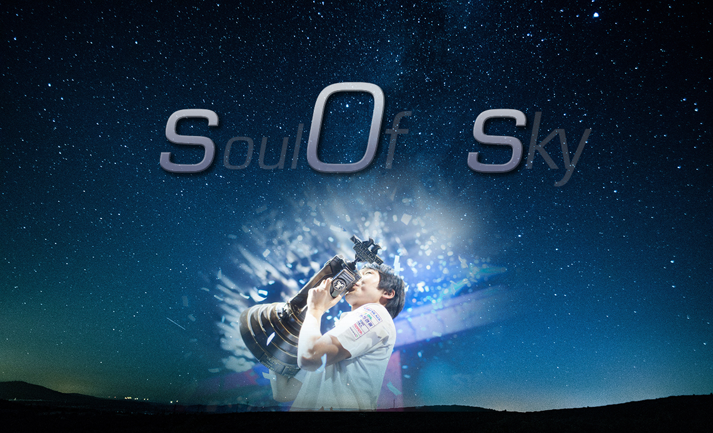
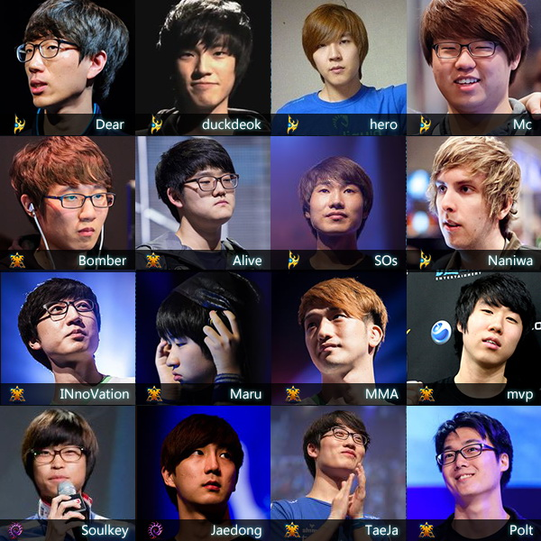
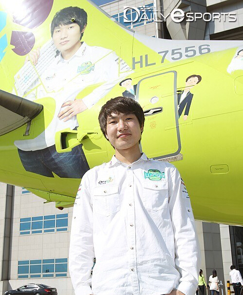

# sOs : Soul of Sky

Kim **"sOs"** Yoo Jin

**唯一**拿过两届WCS世界总决赛冠军的选手(2013,2015)

## 职业生涯

狗哥1993年10月6号出生在韩国[泗川市](https://baike.baidu.com/item/泗川市/10572647?fr=aladdin)的一个小村庄。因为时值秋收，他又出生在乡下，父母没法悉心照料他。

他的家境并不好，但父母还是尽力让小狗哥衣食无忧。他小时候就和父亲一起干农活。因为泗川市临海，他也会和父亲一起去挖蛤蜊。他回忆从前：“我会把能吃的都带回家。”

在狗哥小时候，学校让学生写信给家长。狗哥写下了他想当职业选手的愿望。当时，狗哥的父母甚至不知道"职业选手"是个什么工作。

几个月之后，因为家附近没有网吧，所以狗哥放学后没有回家，而是跑到学校附近的网吧看别人打游戏。狗哥的母亲害怕狗哥出事，就打电话叫了警察。联想到狗哥说要当职业选手，狗哥母亲就让警察到学校附近的网吧找一找。果然，警察把狗哥抓个正着。20分钟后，伴随着警笛的啸叫，狗哥被逮了回来。

狗哥的原话是：“我怕惹上麻烦，但我更喜欢星际。”

从高一开始，狗哥正式考虑打职业。开明的父母支持狗哥去尝试一下。

他顺利地通过选拔，成为一名职业选手。“那时，我感觉拥有了人生中想要的一切。我终于熬出头了。”

### 星际1时期

https://liquipedia.net/starcraft/SHy

2010年加入[Hwaseung OZ](https://liquipedia.net/starcraft/Hwaseung_OZ)战队，当时的战队扛霸是Jaedong。在“暴君”解冻的光环下，当时18岁的狗哥并没有亮眼的战绩。估计sOs自己也不会想到，3年后他会在WCS年终总决赛的舞台上和Jaedong以对手的身份再次相遇。狗哥最早的ID为sHy，所以在一些早期比赛视频的标题中，也会有"羞本"的外号出现。

2011年8月，ProLeague由12支战队缩减为8个战队。Hwaseung(韩国和承集团)停止对OZ战队的赞助，因此OZ战队只能解散重组。

2011年11月，sOs加入熊津([Woongjin Stars](https://liquipedia.net/starcraft/Woongjin_Stars))战队。战队中有现在的“文丑”Impact、“炮哥”BrAvO、还有“丑康”Soulkey。

### 自由之翼时期

2010年星际2正式发售，sOs开始崭露头角。

sOs初次参加星际2比赛是在[2011-2012 Proleague Season 2](https://liquipedia.net/starcraft2/2011-2012_Proleague_Season_2) ，这次比赛由于同时有星际1和星际2的赛程，也被称为混合联赛(hybrid Proleague)。也就是说，同一名选手可能在第一周打星际1，但是到了第二周比赛又要打星际2。熊津战队没能进入季后赛，但sOs个人战绩十分亮眼(星际2比赛中8胜1负)。

2012年开始，SPL(StarProLeague)全面转型星际2。

sOs参加了当年WCS韩国区预选赛，然而成绩并不理想。

由于在KeSPA混合联赛中良好的表现，他以KeSPA 种子选手(共4名，其他三位是)的身份参加GSL。击败jjakji和Seed，获得下赛季GSL S级的名额。GSL S级选手在战队赛OB界面中的ID会变成金色，非S级选手只有白色的普通ID，算是对S级选手的额外奖励。

### 虫群之心时期

### 2013

星际2开启全新的版本，虫群之心将见证星际2历史最强战术型选手的王者之路。

他第一次参加GSL Code S级的比赛，在16强击败Bomber和TaeJa。半决赛中，在先失三局的情况下，狗哥连扳3局将比分改写为3:3平。但是最终还是3:4憾负队友Soulkey，止步四强。Soulkey则在决赛让三追四击败INnoVation获得冠军。

13年6月，WCS第一季决赛。sOs终于在半决赛中3:2击败Soulkey完成复仇。决赛第一盘，狗哥用大量风暴+闪电，利用地形打出巨大战损优势，但因为没有限制INnoVation两翼开矿而落败。整个决赛INnoVation直下四局零封sOs获得冠军。INnoVation强大的基本功还将在未来的交锋中给sOs带来更多的麻烦。

同年6月29号，亚洲室内运动会比赛，sOs和教主代表韩国参赛。sOs夺冠，不过比赛只有奖牌，没有奖金。

13年WCS第二赛季，sOs以种子身份进入32强，在赢下“火星大魔王”EffOrt之后，输给"输本"soO和Maru，从而落入升降级赛(32强、16强每个小组的最后两名要打升降级赛)。在击败“字本”Ruin和“地狱守门人”Curious之后，获得下赛季GSL的参赛资格。

13年8月，12-13赛季的战队联赛总决赛开始。sOs以32胜15负高居多胜榜第三位，和Soulkey一起成为队内大腿。(那年的多胜王是44胜21负的真·教主Flash，而不是后来的李永菜桑苏)熊津战队常规赛表现耀眼，直接晋级季后赛决赛。然而STX Soul靠着INnoVation、Trap、Classic从季后赛最后一名一路杀到决赛，期间两度碾压KT，总计10场比赛中，KT只有教主赢了两场。随后STX“杀虫剂”INnoVation抓掉Soulkey，4-2轻取熊津夺冠。

13年9月，DreamHack布加勒斯特，在8强负于冠军TaeJa。TaeJa在整个淘汰赛阶段一个小分都没有丢。

13年WCS第三赛季在“大雨神”Rain和Trap的小组中止步16强，好在又赢得了升降级赛的胜利，不用去打地狱般的网吧赛。

#### 13年11月，WCS年终总决赛打响。

sOs即将迈出他王者之路的第一步。

三个3:1淘汰HerO、Polt、Bomber，强势杀入决赛。

决赛第一局，阿基隆荒地。前期修地堡逼退虫族二矿，但并没有造成很大影响。反而是Jaedong清掉前置水晶后干扰神族三开，自己跳三本转飞蛇刺蛇。14分30秒，200人口飞蛇双喷骑脸，但sOs猥琐防守，因此只能限制神族四矿。时间来到26分30秒。虫族200人口大牛腐化直指神族四矿，但在不朽白球威力下只能落荒而逃，3点钟方向的虚空单枪匹马找到了一个不可思议的角度，戳掉了在3个防空保护下的残血基地。侧翼因为被神族打掉飞龙塔导致空有巨量存款却无法造兵，sOs的200人口高质量部队一波推平jaedong。

决赛第二局，无主岗哨。又见修地堡。sOs卡了虫族二矿后两根柱子的奇葩位，只用两个水晶就封死了路口。Jaedong犹豫不决导致自己反而被封了两个农民在地堡阵里。占了优势之后看准Jaedong没有出蟑螂，一波一攻叉进家然后双VS转凤凰，堂口兄弟在虫族家里翻江倒海，凤凰打光了主矿所有气球。

决赛第三局，旋风平台。Jaedong拼一枪裸三，神族双开后vs出虚空。8分30秒，虚空戳掉11点钟的房子然后偷矿，由于sOs在自己三矿处做的各种表情，这个偷矿直到比赛结束都没有被发现。Jaedong没有发现神族三矿，导致自己迟迟不敢下四矿。神族看见龙塔但没有出凤凰。12分30秒，一队飞龙接连打掉VC VT，差一点就升级好的闪电和冲锋都被打断，比赛局势瞬间改变。虫族大龙感染的三本部队换完神族部队，随后的30多条飞龙A平了神族。（这也是Jaedong在WCS星际2比赛决赛的首胜）

决赛第四局，极地永夜。sOs在主矿边角下VR，导致虫族房子迟迟没有侦查到神族开局。打掉房子后，sOs选择两矿单气极限两不朽一波，8分50秒到虫族二矿 。Jaedong毫无防备，被一波打死。

决赛第五局，霜寒之地。四人图两人出生在对角。Jaedong在赛点局怕被修地堡，转而选择慢狗开。sOs似乎是算准了Jaedong求稳，直接不探路裸双偷到底。5分20秒下VS，9分钟一波叉带凤凰打伤虫族。15分钟，三个两攻巨像带哨兵追猎，直接扫平了蟑螂刺蛇。

决赛4:1碾压Jaedong豪取10万美金，拿下第一个P级冠军。而Jaedong在2013年的五次决赛上均失利，“收获”当年P级赛事五连亚，被网友戏称为“全球总亚军”、“冠军之友”。

夺冠后，狗哥将一半奖金分给父母，让他们买了一辆车。

2013年11月，作为WCS新科冠军的sOs受邀参加红牛杯，击败Scarlett之后1:4负于PartinG，获得亚军。

2013年12月，sOs加入绿翼( [Jin Air Green Wings](https://liquipedia.net/starcraft2/Jin_Air_Green_Wings))，同时Soulkey确定加入豪门战队SKT1。随着最后两名队员的离开，由于熊津集团破产而失去赞助的熊津战队(Woongjin Stars)正式解散。

### 2014

2014年GSL第一赛季，sOs打入S级，在8强被“神族内奸”Zest零封。Zest也在此后很长一段时间成为sOs的苦手。

#### 2014年3月 IEM卡托维茨世界总决赛

这是个赢家通吃的比赛(a winner take all tournament)，冠军占尽10万美金，而其他人没有任何奖金，只有WCS积分。

8强比赛3:0碾压jjakji。航母闪电白球巨像的组合全灭人族部队之后只损失了20人口。半决赛，高智商幻象棱镜调虎离山，然后不朽虚空一波打穿TaeJa。

决赛，IEM最经典的镜头即将上演。

sOs开启抢钱模式，连续两盘野2BG，准确把握herO心理，连下两城。第三局没有发现herO的隐刀，很干脆的直接GG。第四局四人图，herO单矿闪追一波，但是被sOs果断的拖农民堪堪守住。随后不朽反打，再下一局。

整个总决赛光速打完，5场总计用时不到40分钟。拿走两个10万美金冠军之后，sOs获得了$O$的外号。

2014年5月 GSL第二赛季，sOs以种子身份参加32强，和队友Soulkey在旋转木马上打了一场刺激的比赛之后，没有从小组出线，落入A级。

2014年7月SPL，绿翼止步季后赛首轮，但是sOs在这个赛季和herO并列获得多胜王。

2014年12月Hot6ix Cup，8强3:1击败老对手卫星，四强3:0轻取“四差人族”sKyHigh。决赛对手是3:0击败PartinG，3:2淘汰Zest的“山包”MarineKing，隐隐有王者归来之势。然而决赛让人大跌眼镜，sOs智商碾压，4:1完胜枪兵王夺冠。

### 2015

2015狗哥开局不顺，SSL输给Curious折戟预选赛。3天后，再次输给Curious，未能从GSL出线。这意味着这赛季SSL和GSL的WCS积分都和狗哥无缘，通往年终总决赛的道路变得异常艰难。

2015赛季的SPL，狗哥用了个奇妙的战术击败TY(https://liquipedia.net/starcraft2/2015_Proleague/Round_1/Round_Robin#Round_1W1_-_Match_3)，但在之后的比赛中输给innovation和Leenock这样的一流选手。（略去部分内容）季后赛第一轮，StarTale-闪电狼联队没有按时到场，所以直接被判负，JinAir晋级下一轮。

3月4日，sOs成功晋级GSL A级。

3月26日，重返SSL。

4月3日，重返GSL S级。

4月10日，输给Dear再次折戟SSL。

5月20日，GSL S级32强再次输给Curious，好在赢下后两场成功晋级16强。16强B组是死亡之组，组内有“神族之盾”Rain, “人族狗哥”Bbyong和 INnoVation。最终双神携手晋级。8强3:0轻取蒙斯克，但是在4强4:2负于ByuL。这个4强成绩为狗哥提供了至关重要的900点WCS积分。

6月25日，参加SSL 第三赛季预选赛，成功晋级正赛。

6月29日 在SPL完成个人对CJ的All-Kill，对手是herO、ByuL、Bbyong、RagnaroK。

7月1日，参加2015MSI预选赛，再次输给苦手Zest，无缘正赛。**但是伏笔已经埋下。**

7月3日，SSL3:2艰难战胜Solar，但自己也陷入同时打多个赛事的尴尬境地。

7月30日，未能在herO、innovation、Life的死亡之组中出线，止步16强。

与此同时，由于上赛季晋级8强，所以sOs以种子身份参加GSL第三赛季，从Bbyong、Life、Stork的小组中头名出线。

8月30-31日，一次意外改变了一切。狗哥本来是没资格参加MSI的(预选赛0:2输给Zest)，但是因为当年的神族内奸Zest要去拯救战队，所以**空缺的名额让狗哥顶替了**。狗哥开启抢分模式，8强2:0淘汰viOLet，半决赛连狗两盘2:0击败老对手innovation，随后3:0血洗Solar获得冠军，拿到极其宝贵的750WCS积分。总积分从17名跃升至13名(前16名晋级年终总决赛)。

9月4日，GSL倒在16强，但是无伤大雅。拿走最后的300WCS积分，年终总决赛的入口已经畅通无阻。

9月21日，SPL季后赛复仇Zest，帮助战队4:1拿下第一场。紧接着，9月22日，在教主连下三局的情况下，以一敌四反AK KT战队，成就SPL历史上唯一一次反AK记录。（我不仅要白拿你的名额，我还要血洗你的战队！）同时也获得此轮MVP。

不到一周时间，sOs又参加了2015年DreamHack。8强3:1解决老对手Curious，半决赛2:3负于Solar。四强的375分WCS积分再次巩固了参加年终总决赛的席位。

9月29日，季后赛第二轮。复仇ByuL，第二场更是先灭herO，最后再次干掉ByuL一锤定音，将战队送入决赛。在决赛中sOs再次负于innovation，绿翼也不敌强大的SKT，再次屈居亚军。

最终所有WCS积分赛打完，sOs以3525分居于14名，晋级WCS年终总决赛。

--------------------------------------------------更新至此---------------------------------------------------

The Round of 16 of the [2015 WCS Global Finals](https://liquipedia.net/starcraft2/2015_WCS_Global_Finals) was played on November 1 at the ESL Studio in Burbank, California.

2015年传奇WCS征程 两次blizzcon冠军，史无前例

很多人都知道将悬念保留到最后一秒的BO7决赛，但很少有人知道那一年狗哥进入WCS名单的过程有多么惊险。

传奇从2015年的MSI开始。当时狗哥WCS积分只有17名(前16名有资格参加年终总决赛)，剩下的大赛只有两场(MSI和Dreamhack)，因此形势并不乐观。

16进8的比赛中，与Parting的操作较量不落下风。

不同于16年ByuN和Dark在WCS总决赛上精细操作的极限交锋，15年的这场WCS更像是一场宏观策略的终极较量。

棋逢对手VS Life

在2013年11月-2015年底将近两年的时间里，sOs一共获得了约41.3万美元的奖金，其中3届奖金超过10万美元的大型赛事被sOs一人包揽(WCS2013、IEM8、WCS2015)，成为虫群之心时期的“吸金王”。sOs也因为这三个冠军而获得了“$$$”的外号，甚至他的战队赞助商JinAir把他的头像印在了JinAir航空的飞机上来为他庆祝。

### 虚空之遗时期

### 总结

狗哥之所以能成为星际2的一面旗帜，一部分是因为他优秀的大赛成绩，但更重要的是他向我们展示了星际2的无限可能性。战术型选手可以走上最高领奖台，心理战可以成为比赛的决定性因素，智商可以胜于操作。与Maru和PartinG这种通过彻底锤炼操作来战斗的选手不同，狗哥以其诡异多变的战术和策略走出了一条截然不同的道路。

或许sOs是否是星际2第一神族还有争议。但可以肯定的是，他绝对是星际2最特别的选手，也是星际2最强的战术大师。纵观狗哥职业生涯，尽管他不能给出长时间的稳定的优秀表现，但任何一个时间点，他都可能爆发出超一流的能量。

### 尾声

狗哥成为了全泗川的骄傲。

“如果我是个普通人，读大学之后服兵役，毕业之后就工作，我就不可能像现在一样享受生活。回忆过去，即使我在家乡的小镇上打得很好，我也只是小地方的大人物。我抓住了机会并努力至今，我为此感到骄傲。”

## 趣闻

1. 连续三把野隐刀

2. 六字真言 https://www.bilibili.com/video/av1548392/?p=2 38:45

3. 奖金越高，状态越好

4. 苦手innovation，被地雷炸惨

5. WCS 2018 3:0 Maru

6. 其实狗哥实力比较稳定 neotv帖子

7. $O$

8. 跳P看狗哥

9. 狗哥出处

10. 反AK教主

11. 狗哥提速狗开

12. 二刀流 GSL决赛

13. 最特别的星际2选手

14. 2VC升级闪烁和脚速

15. who lets the dogs out

16. 2015年韩国电竞大奖

    http://s.163.com/15/1125/17/B99KQJ7800314Q8M.html#p=B99K4JVL55LG0031

17. 小hero的主人 

    https://www.bilibili.com/video/av44431567  7:54

    https://www.bilibili.com/video/av52486257?from=search&seid=5001295910168760499 2:50 想用键盘砸sos的头

18. 苦手Zest

19. WCS赛场 从Parting开始的冠军旗

20. 狗哥 免疫一切大招的男人

21. 狗哥MGA决赛幻象追猎吓退solar

22. https://www.bilibili.com/video/av19930662/#page=2  第二局从头到尾爆智力

23. KeSPA的关系

24. sos流 PVT运营完善

25. 好星际导师

## 特效参考

狗哥家庭采访 

https://www.bilibili.com/video/av19079914?from=search&seid=18336813617568419515

singature 

https://www.bilibili.com/video/av33130479?from=search&seid=16883833405691858184

伟大的卫国战争

拿破仑侵俄战争

### BGM

Global visions

## 参考资料：

https://liquipedia.net/starcraft2/SOs

https://en.wikipedia.org/wiki/Kim_Yoo-jin_(video_game_player)

https://liquipedia.net/starcraft2/Proleague

http://bbs.niuyou5.com/thread-2359683-1-1.html

https://liquipedia.net/starcraft2/2015_MSI_Masters_Gaming_Arena

https://liquipedia.net/starcraft2/2015_WCS_Global_Finals

http://bbs.niuyou5.com/forum.php?mod=viewthread&tid=2245505&extra=page%3D1%26filter%3Ddigest%26digest%3D1

https://www.bilibili.com/video/av19079914

https://www.bilibili.com/read/cv2781721

http://bbs.niuyou5.com/forum.php?mod=viewthread&tid=2335465

http://bbs.niuyou5.com/forum.php?mod=viewthread&tid=2323430

https://www.zhihu.com/question/325446267

记者：你觉得你是你们队的王牌吗？  Trap：不，是我们的总教练，sOs。

选手logo：

https://www.reddit.com/r/starcraft/comments/3d64db/ssl_season_3_player_logos_profile_pics_explained/

https://tl.net/forum/starcraft-2/490143-ssl-qualifier-emblems

 https://www.reddit.com/r/starcraft/comments/5iiauk/ssl_player_logos_explained_2016_seasons_1_2/  

