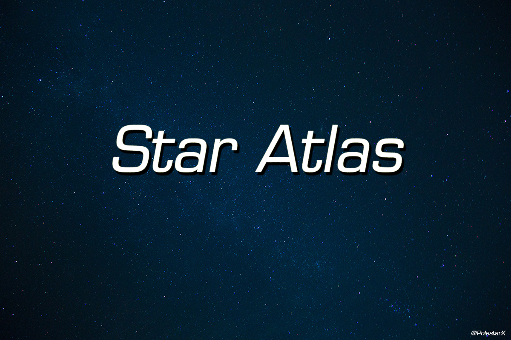

# Star Atlas计划

### 群星录第二季

目标：更详尽的资料、更深度的分析、更精美的特效

所有剧本、资料、BGM都在和选手ID对应的文件夹中，**韩宗注意**。

评论区不会回复求BGM相关的评论。

## 一、分集进度

1. sOs：Soul of Sky

   剧本：20%

   素材收集：40%

   特效制作：0%

2. 

##### 其他备选选手(未提及的可以私信补充)：

Soo InnoVation Serral  Maru PartinG MVP NesTea Jaedong Stork Flash MKP Boxer ByuN DongRaeGu Scarlett Soulkey  Dark Reality herO Stats Zest TY Hero Life Classic  Solar MajOr **F91** TIME Toodming Jim Macsed Xigua iA XY Top **Courage** Cloudy Has Sen San Bomber MMA Polt MC Rain Dear Trap effort stephano Naniwa SC FruitDealer Dream LoSira Squirtle Hyun Creator Curious  Keen  Gumiho Stardust Action roro Shine Fantasy Hyvaa Hydra Skyhigh Jjakji SuperNoVa HuK ToD ShowTime  FireCake TLO ByuL 	Lilbow ForGG Bbyong Leenock 	MyuNgSiK Snute MaNa aLive Cure TRUE  Impact Sakura RagnaroK Firefly 

## 二、新一季节目的说明

1. 各位可以到我的网站上上传自己喜欢选手的高光时刻。

   上传的越多，对应选手的节目就会越早更新。

2. 后续更新问题。对我个人来说，开坑看兴趣，填坑看观众反映。如果反响比较好的话会一直做下去。当然，可能会夹杂一些例如翻译类、P社游戏的视频，不喜欢的可以跳过。

   **目前有成立制作组的考虑**。一个人做确实比较自由，想鸽多久鸽多久(2333),但是对于观众其实是不太负责的。我深入了解的选手其实很少，所以需要一些剧本上的帮助。

3. 新一季的第一集还是狗哥，会对原来内容大幅增补，相当于是全新的一集，同时也是试水作。从第二集开始，选手不再重复。

## 三、对之前节目的反思

1. 之前几期节目**普遍存在**的转场无过渡问题。这一点在新一季中会重点解决。

2. 打野集锦等问题。虽然有些质疑完全是云玩家和杠精，不过虫族镜头较少确实是个问题。新一季每三个视频中，ZPT各会出现一次(如果评价比较好的话)。

3. “非人类”的操作TOP30中丑陋的长片头问题。当时是为了填补BGM时长的空缺，所以又加了一个现在看来确实是画蛇添足的多余片头。我发现这个问题时，视频弹幕已经比较多了。考虑到其中有很多解释战术的高质量弹幕，我就没有重新上传视频。就当是一个教训吧。在这之后的视频其实都没有出现过这个问题了。

4. 某两集标题党问题。首先说明，我个人很反对标题党行为。之前的节目中，有观众反映两期TOPXX节目有标题党嫌疑，在此向新观众解释一下标题由来。这两期节目的内容是由贴吧吧友justindaisy9的贴子整理而来，因此保留了原贴标题。当时justindaisy9在找人帮忙做个合集，我就顺手帮忙了。justindaisy9提供的片段质量都很高，在此表示感谢。由于视频年代久远，当时还没有激励计划，我本人并未从该视频获得任何直接收益，当时也没有想到会有这么多播放量。我相信justindaisy9本人也不是想利用这个标题获取收益，只是想和星际爱好者分享乐趣。

   总之，之后的节目都不会再出现任何疑似标题党的内容。